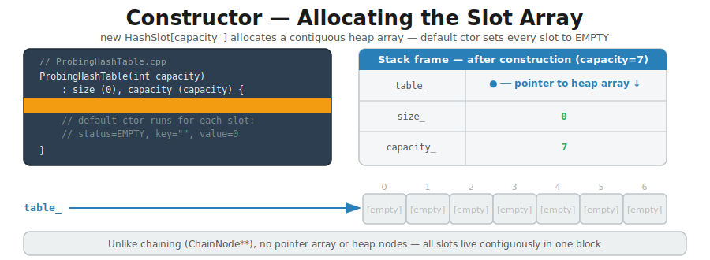
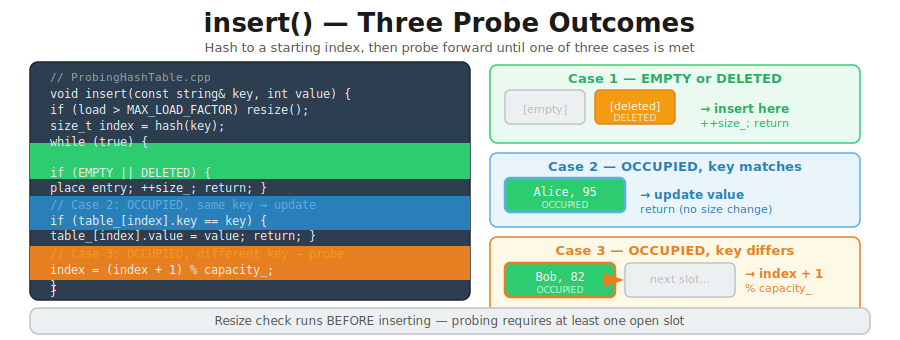
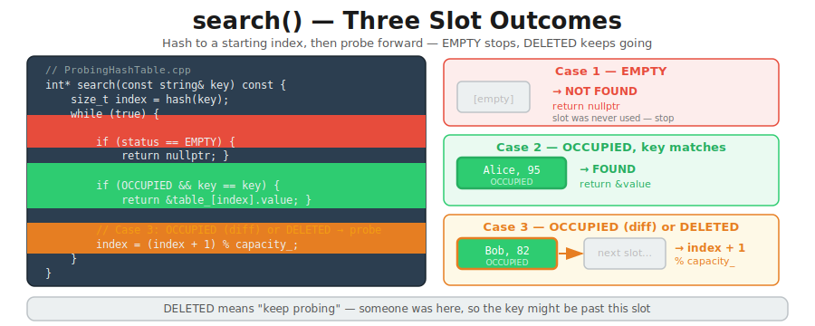
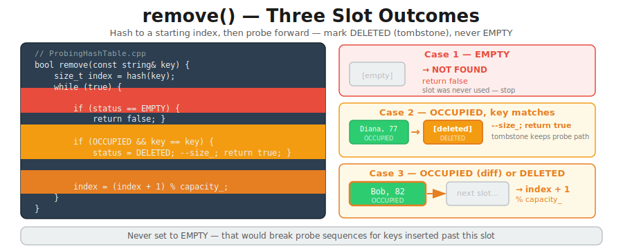
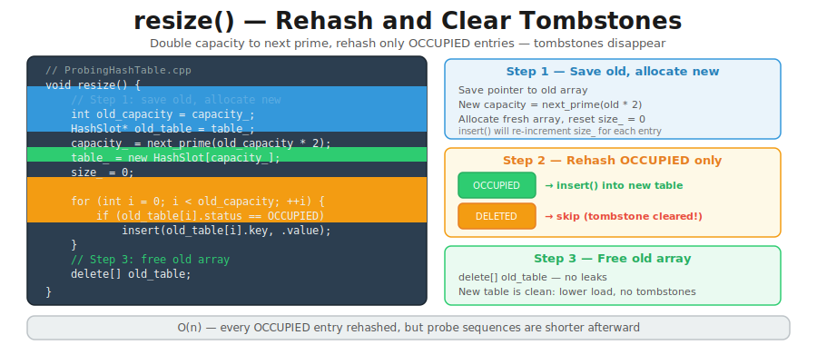

# CT11 — Implementation Diagrams

Code-block diagrams referenced from `ProbingHashTable.cpp`.

---

## 1. Tombstone Pattern — Why DELETED, Not EMPTY
*`ProbingHashTable.cpp::remove()` — why marking EMPTY instead of DELETED would break search*

---

## 2. Primary Clustering — Why Probing Slows Down
*`ProbingHashTable.cpp::insert()` — why occupied runs grow and slow things down*

---

## 3. Constructor — Allocating the Slot Array
*`ProbingHashTable.cpp::ProbingHashTable()` — code + stack frame + initial heap state after new HashSlot[capacity_]*

---

## 4. insert() — Three Probe Outcomes
*`ProbingHashTable.cpp::insert()` — code alongside the three slot states and what each does*

---

## 5. search() — Three Slot Outcomes
*`ProbingHashTable.cpp::search()` — code alongside the three slot states: EMPTY stops, OCCUPIED checks key, DELETED keeps probing*

---

## 6. remove() — Three Slot Outcomes
*`ProbingHashTable.cpp::remove()` — code alongside the three slot states: EMPTY stops, OCCUPIED marks DELETED, keeps probing past tombstones*

---

## 7. resize() — Rehash and Clear Tombstones
*`ProbingHashTable.cpp::resize()` — code alongside the three steps: save old, rehash OCCUPIED, free old*

