# CT11 — Probing Hash Table Diagrams

Diagrams in the order they appear in the code, from `HashSlot.h` → `ProbingHashTable.h` → `ProbingHashTable.cpp`.

---

## 1. Probing Hash Table — Flat Array of HashSlots
*`HashSlot.h` / `ProbingHashTable.h` — flat array of HashSlots (no chains, no pointers)*

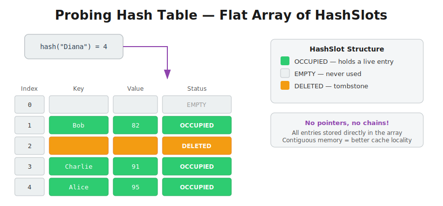

---

## 2. SlotStatus — Three States
*`HashSlot.h` — the three states every slot can be in*

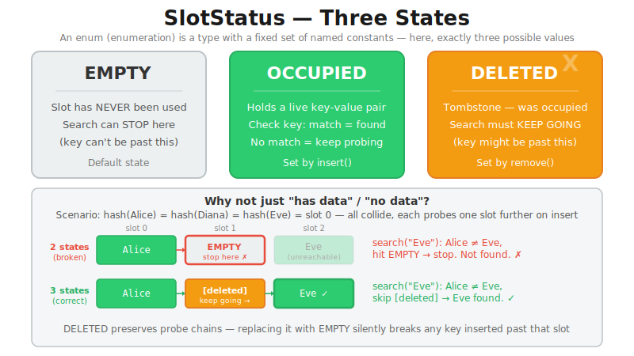

---

## 3. Probing vs. Chaining — Two Memory Layouts
*`ProbingHashTable.h` — why probing uses a flat array instead of pointer chains*

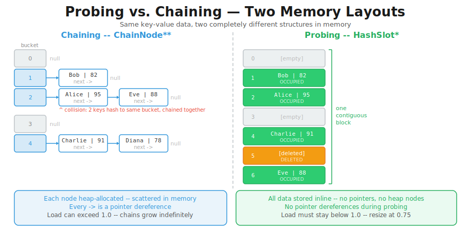

---

## 4. Cache Locality — Why Probing Is Faster in Practice
*`ProbingHashTable.h` — why contiguous memory beats pointer chasing*

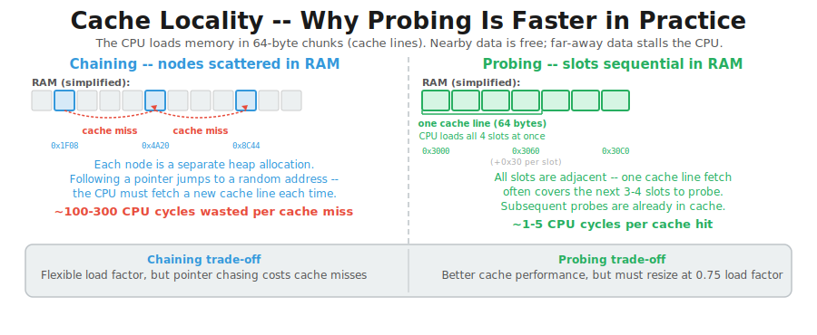

---

## 5. Load Factor Threshold — Why Resize at 0.75?
*`ProbingHashTable.h` — why probing resizes at 0.75, not 1.0*

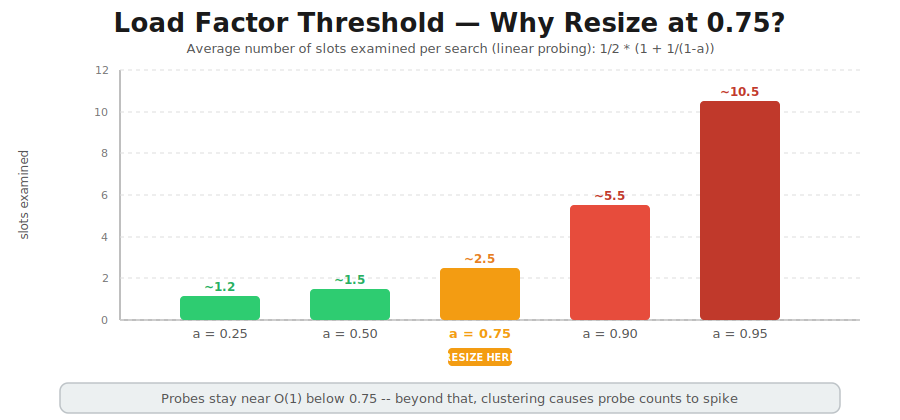

---

## 6. Linear Probing — Insert "Diana"
*`ProbingHashTable.h` / `ProbingHashTable.cpp::insert()` — collision resolved by scanning forward*

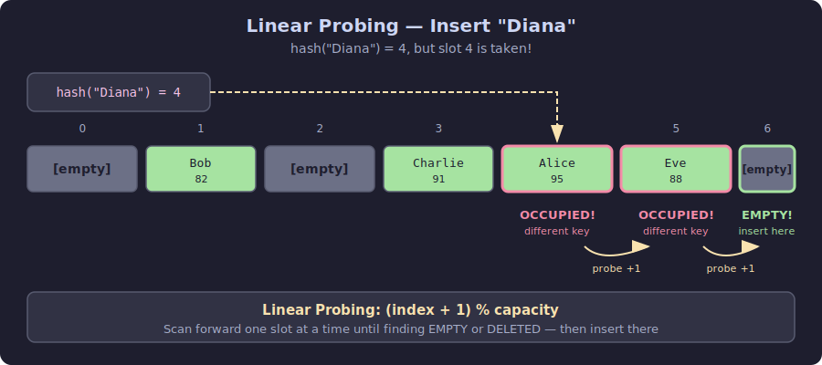

---

## 7. Linear Probing — Search
*`ProbingHashTable.cpp::search()` — found vs. not found, probing past tombstones*

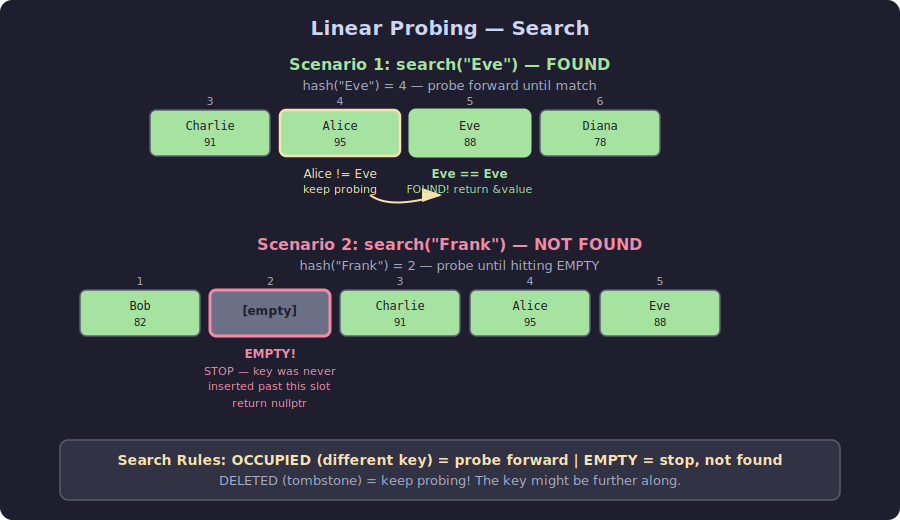

---

## 8. Linear Probing — Remove
*`ProbingHashTable.cpp::remove()` — probe forward to find the key, then mark the slot DELETED*

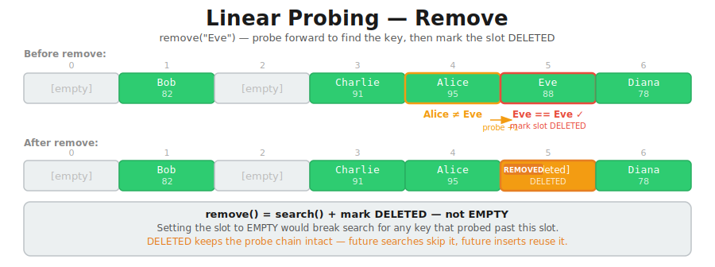

---

## 9. Tombstone Pattern — Why DELETED, Not EMPTY
*`ProbingHashTable.cpp::remove()` — why marking EMPTY instead of DELETED would break search*

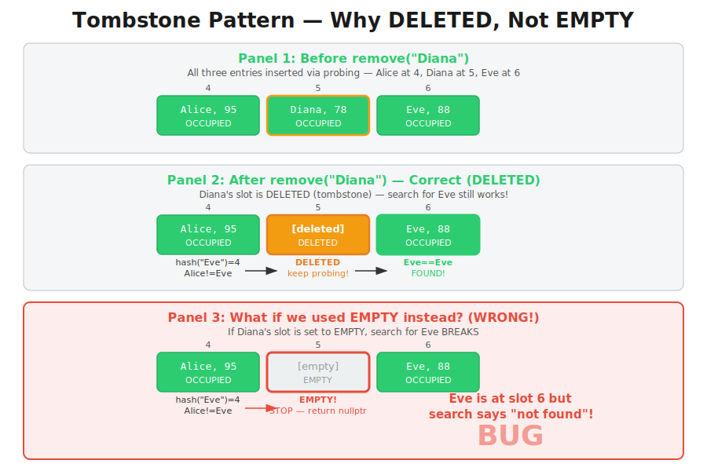

---

## 10. Primary Clustering — Why Probing Slows Down
*`ProbingHashTable.cpp::insert()` — why occupied runs grow and slow things down*

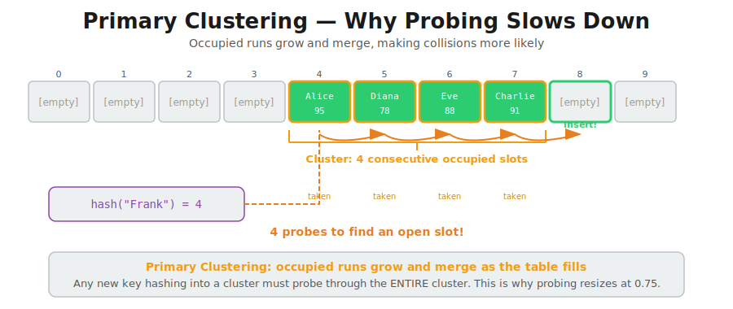

---

## 11. Resize — Rehash OCCUPIED, Clear Tombstones
*`ProbingHashTable.cpp::resize()` — before/after growing the table and rehashing all entries*

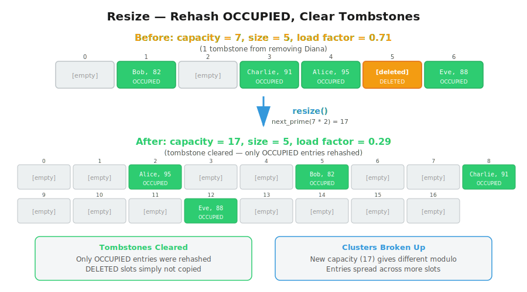
